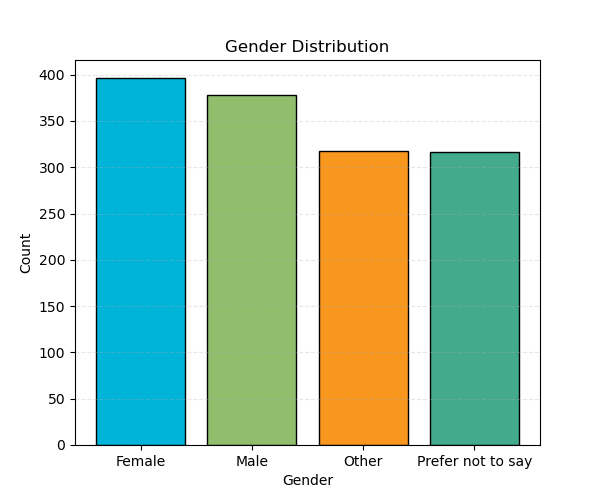
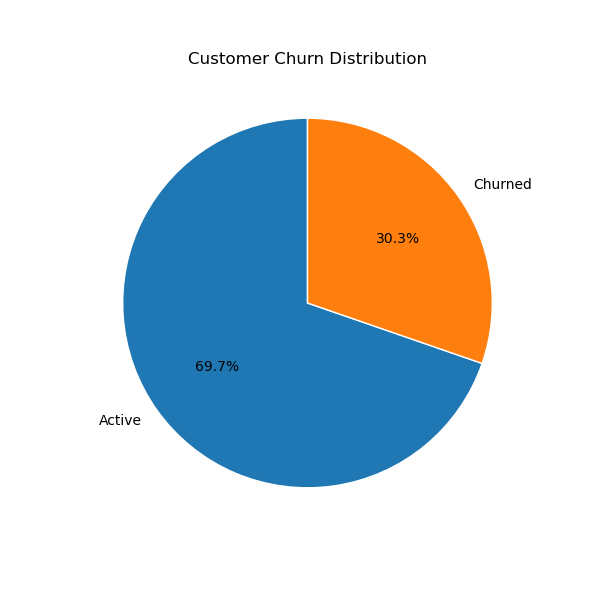
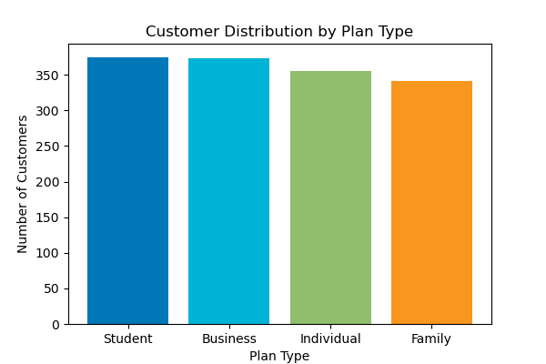
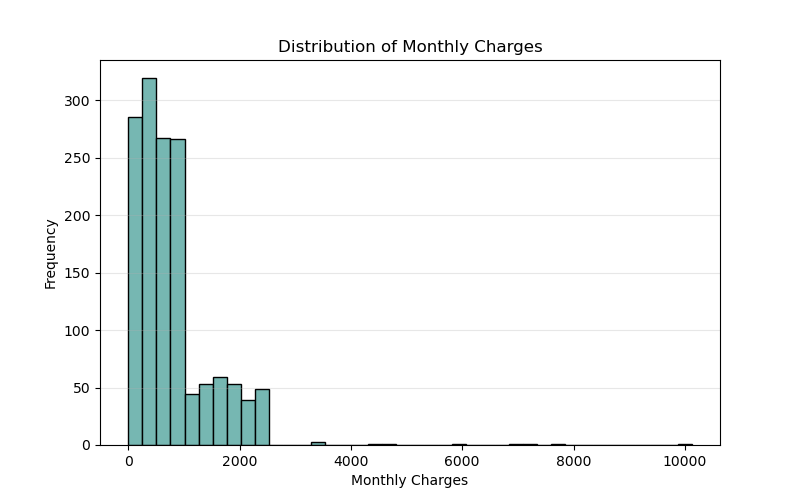
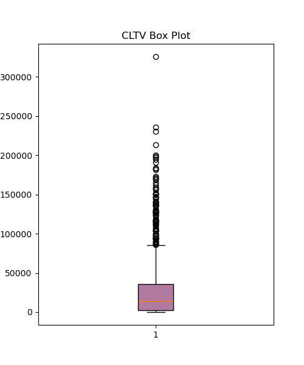
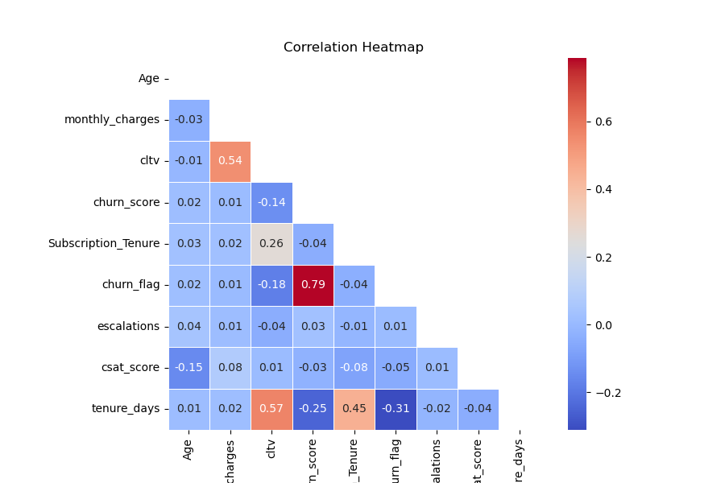
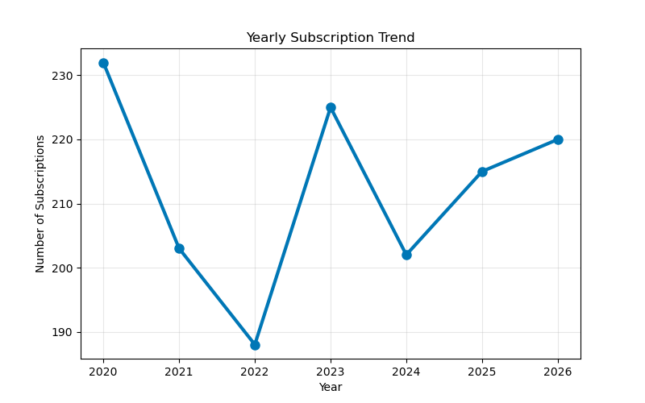

# 📊 Customer Churn Analysis using SQL & Python

## 📌 Project Overview

Customer churn is one of the biggest challenges faced by subscription-based businesses. Understanding why customers leave helps organizations improve customer retention, increase customer satisfaction, and maximize revenue.

This project presents an end-to-end customer churn analysis using **SQLite, SQL, Python, Pandas, NumPy, Matplotlib, and Seaborn**.

The analysis follows the complete Data Analytics workflow:

- Data Loading
- Data Cleaning
- Feature Engineering
- Exploratory Data Analysis (EDA)
- SQL Analysis
- Data Visualization
- Business Insights

The objective of this project is to transform raw customer data into meaningful business insights that support data-driven decision-making.


---

## 🛠️ Tools & Technologies

| Category | Tools |
|----------|-------|
| Programming Language | Python, SQL |
| Database | SQLite |
| Data Analysis | Pandas, NumPy |
| Data Visualization | Matplotlib, Seaborn |
| Development Environment | Jupyter Notebook |
| Version Control | Git & GitHub |


---

## 📂 Dataset

This project uses a **synthetic customer churn dataset** stored in a SQLite database (`customer_churn.db`).

The database contains **1,500 customer records** distributed across three related tables.

### Database Tables

| Table Name | Description |
|------------|-------------|
| `db_customer` | Stores customer demographic and personal information. |
| `db_subscription` | Stores subscription details, billing information, churn status, and Customer Lifetime Value (CLTV). |
| `db_support` | Stores customer support interactions, complaints, and Customer Satisfaction (CSAT) records. |

The data from these three tables was loaded, cleaned, transformed, and analyzed using SQL and Python to generate business insights.


---

## 🔄 Project Workflow

This project follows a complete end-to-end Data Analytics workflow:

1. Import required Python libraries.
2. Connect to the SQLite database.
3. Load data from multiple tables.
4. Perform data cleaning and preprocessing.
5. Apply feature engineering.
6. Conduct Exploratory Data Analysis (EDA).
7. Analyze business problems using SQL queries.
8. Create visualizations using Matplotlib and Seaborn.
9. Generate business insights.
10. Summarize findings and conclusions.

---

## 📁 Repository Structure

```text
customer-churn-analysis/
│
├── data/
│   └── customer_churn.db
│
├── notebooks/
│   └── customer-churn-analysis.ipynb
│
├── images/
│   ├── gender_distribution.png
│   ├── churn_distribution.png
│   ├── customer_distribution_by_plan.png
│   ├── monthly_charges_distribution.png
│   ├── cltv_box_plot.png
│   ├── correlation_heatmap.png
│   └── yearly_subscription_trend.png
│
├── README.md
├── requirements.txt
└── .gitignore
```


---

## 📈 Exploratory Data Analysis & Visualizations

The following visualizations were created during the Exploratory Data Analysis (EDA) phase to better understand customer behavior, subscription patterns, and churn trends.

### 1. Gender Distribution

Shows the distribution of customers across different gender categories.



---

### 2. Customer Churn Distribution

Shows the proportion of active customers and customers who have churned.



---

### 3. Customer Distribution by Plan

Displays how customers are distributed across different subscription plans.



---

### 4. Monthly Charges Distribution

Illustrates the distribution of monthly subscription charges among customers.



---

### 5. CLTV Box Plot

Highlights the distribution of Customer Lifetime Value (CLTV) and identifies potential outliers.



---

### 6. Correlation Heatmap

Visualizes the correlation between numerical variables to identify important relationships.



---

### 7. Yearly Subscription Trend

Shows customer subscription trends over different years.



---

## 💡 Key Business Insights

- Around **69.7%** of customers are active, while **30.3%** have churned.
- Customer distribution is fairly balanced across all subscription plans, with approximately **340–370 customers** in each plan.
- **Monthly Charges** and **Customer Lifetime Value (CLTV)** show a moderate positive correlation (**0.54**), indicating that customers paying higher subscription fees generally contribute greater lifetime value.
- **Churn Score** has a strong positive correlation (**0.79**) with the **Churn Flag**, making it a reliable indicator of customer churn.
- A small number of customers have exceptionally high **CLTV (above ₹100,000)**, while the majority fall within a much lower range.
- Customer subscriptions remained relatively stable over the years, with approximately **190–230 new subscriptions annually**.
- Male and Female customers are almost equally represented (**396 Female** and **378 Male**).
- Most customers pay **less than ₹1,000 per month**, while only a small percentage subscribe to premium-priced plans.
- The average **Customer Satisfaction (CSAT)** score is **3.05/5**, indicating moderate overall customer satisfaction.


---

## 🎯 Conclusion

This project demonstrates a complete end-to-end customer churn analysis using **SQLite, SQL, Python, Pandas, NumPy, Matplotlib, and Seaborn**.

The project involved:

- Loading data from a SQLite database.
- Cleaning and transforming customer, subscription, and support datasets.
- Creating new features such as **Age**, **Subscription Tenure**, **Annual Charges**, and **Churn Flag**.
- Performing Exploratory Data Analysis (EDA) and creating visualizations.
- Writing SQL queries to answer key business questions.
- Identifying customer behavior patterns and churn-related trends.

The final analysis provides actionable business insights that can help organizations improve customer retention strategies and support data-driven decision-making.


--- 
## 📬 Contact

If you have any suggestions or feedback regarding this project, feel free to connect with me on LinkedIn.


